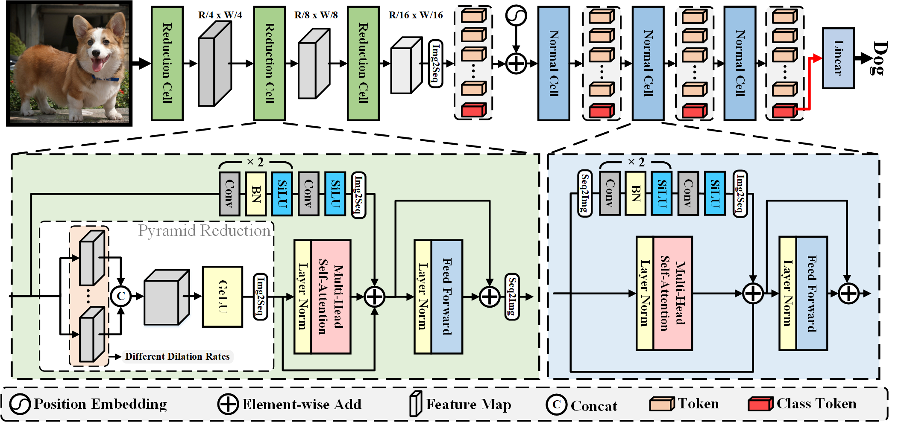
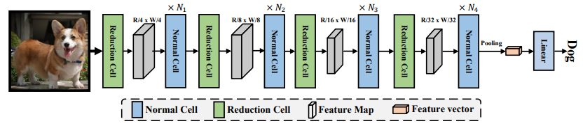

<h1 align="left">VSA: Learning Varied-Size Window Attention in Vision Transformers</h1> 

<!-- <p align="center">
  <a href="#Updates">Updates</a> |
  <a href="#introduction">Introduction</a> |
  <a href="#Usage">Usage</a> |
  <a href="#results">Results&Pretrained Models</a> |
  <a href="#statement">Statement</a> |
</p>

## Current applications

> **Image Classification**: Please see <a href="#Usage">Usage</a> for a quick start;

> **Object Detection**: Please see <a href="https://github.com/ViTAE-Transformer/ViTAE-Transformer/tree/main/Object-Detection">ViTAE-Transformer for object detection</a>;

> **Sementic Segmentation**: Please see <a href="https://github.com/ViTAE-Transformer/ViTAE-Transformer/tree/main/Semantic-Segmentation">ViTAE-Transformer for semantic segmentation</a>;

> **Animal Pose Estimation**: Please see <a href="https://github.com/ViTAE-Transformer/ViTAE-Transformer/tree/main/Animal-Pose-Estimation">ViTAE-Transformer for animal pose estimation</a>;

> **Matting**: Please see <a href="https://github.com/ViTAE-Transformer/ViTAE-Transformer-Matting">ViTAE-Transformer for matting</a>;

> **Remote Sensing**: Please see <a href="https://github.com/ViTAE-Transformer/ViTAE-Transformer-Remote-Sensing">ViTAE-Transformer for Remote Sensing</a>;


## Updates
***24/03/2021***
- The pretrained models for both ViTAE and ViTAEv2 are released. The code for downstream tasks are also provided for reference.

***07/12/2021***
- The code is released!

***19/10/2021***
- The paper is accepted by Neurips'2021! The code will be released soon!
  
***06/08/2021***
- The paper is post on arxiv! The code will be made public available once cleaned up.

## Introduction

<p align="left">This repository contains the code, models, test results for the paper <a href="https://arxiv.org/pdf/2106.03348.pdf">ViTAE: Vision Transformer Advanced by Exploring Intrinsic Inductive Bias</a>. It contains several reduction cells and normal cells to introduce scale-invariance and locality into vision transformers. In <a href="https://arxiv.org/pdf/2202.10108.pdf">ViTAEv2</a>, we explore the usage of window attentions without shift operations to obtain a better balance between memory footprint, speed, and performance. We also stack the proposed RC and NC in a multi-stage manner to faciliate the learning on other vision tasks including detection, segmentation, and pose.

<figure>

<figcaption align = "center"><b>Fig.1 - The details of RC and NC design in ViTAE.</b></figcaption>
</figure>

<figure>

<figcaption align = "center"><b>Fig.2 - The multi-stage design of ViTAEv2.</b></figcaption>
</figure> -->

## Usage

### Install

- Clone this repo:

```bash
git clone https://github.com/ViTAE-Transformer/ViTAE-VSA
cd ViTAE-VSA/Image-Classification
```

- Create a conda virtual environment and activate it:

```bash
conda create -n vitae python=3.7 -y
conda activate vitae
```

```bash
conda install pytorch==1.8.1 torchvision==0.9.1 cudatoolkit=10.2 -c pytorch -c conda-forge
```

- Install `timm==0.4.12`:

```bash
pip install timm==0.4.12
```

- Install `Apex`:

```bash
git clone https://github.com/NVIDIA/apex
cd apex
git reset --hard a651e2c24ecf97cbf367fd3f330df36760e1c597
pip install -v --disable-pip-version-check --no-cache-dir --global-option="--cpp_ext" --global-option="--cuda_ext" ./
```

- Install other requirements:

```bash
pip install pyyaml ipdb
```

### Data Prepare
We use standard ImageNet dataset, you can download it from http://image-net.org/. The file structure should look like:
  ```bash
  $ tree data
  imagenet
  ├── train
  │   ├── class1
  │   │   ├── img1.jpeg
  │   │   ├── img2.jpeg
  │   │   └── ...
  │   ├── class2
  │   │   ├── img3.jpeg
  │   │   └── ...
  │   └── ...
  └── val
      ├── class1
      │   ├── img4.jpeg
      │   ├── img5.jpeg
      │   └── ...
      ├── class2
      │   ├── img6.jpeg
      │   └── ...
      └── ...
 
  ```

### Evaluation

Take ViTAE_basic_Tiny as an example, to evaluate the pretrained ViTAE model on ImageNet val, run 

```bash
python validate.py [ImageNetPath] --model ViTAE_basic_Tiny --eval_checkpoint [Checkpoint Path]
```

### Training

Take ViTAE_basic_Tiny as an example, to train the ViTAE model on ImageNet with 4 GPU and 128 batch size for each GPU (512 batch size in total), run

```bash
python -m torch.distributed.launch --nproc_per_node=4 main.py [ImageNetPath] --model ViTAE_basic_Tiny -b 128 --lr 1e-3 --weight-decay .03 --img-size 224 --amp
```

Our code support multi-node distributed training, and the training scrips of ViTAEv2 variants are given below. 

> [ViTAEv2_S](vitaev2/training_scripts/ViTAEv2_S.sh), [ViTAEv2_48M](vitaev2/training_scripts/ViTAEv2_48M.sh), [ViTAEv2_B](vitaev2/training_scripts/ViTAEv2_B.sh), [ViTAEv2_VSA_S](vitaev2_vsa/training_scripts/ViTAEv2_VSA_S.sh)
[ViTAEv2_VSA_48M](vitaev2_vsa/training_scripts/ViTAEv2_VSA_widePCM_48M.sh)


The trained model file will be saved under the ```output``` folder

## Results

## Main Results on ImageNet-1K with pretrained models
| name | resolution | acc@1 | acc@5 | acc@RealTop-1 | Pretrained |
| :---: | :---: | :---: | :---: | :---: | :---: |
| ViTAEv2-S | 224x224 | 82.6 | 96.2 | 87.6 | [Weights](https://1drv.ms/u/s!AimBgYV7JjTlgRgpIv58qMLokxP6?e=9kQgCo)&[Log](vitaev2/output/ViTAEv2_S.txt) |
| ViTAEv2-48M | 224x224 | 83.8 | 96.6 | 88.4 | [Weights](https://1drv.ms/u/s!AimBgYV7JjTlgRnQjbNipq0_OLKM?e=75TzxI)&[Log](vitaev2/output/ViTAEv2_48M.txt) |
| ViTAEv2*-VSA-S | 224x224 | 82.7 | 96.3 | | [weights]()&[log](vitaev2_vsa/output/ViTAEv2-S+VSA.txt) |
| ViTAEv2*-VSA-48M | 224x224 | 83.9 | 96.6 | | [weights]()&[log](vitaev2_vsa/output/ViTAEv2-48M+VSA.txt) |

## Models with ImageNet-22K pretraining
| name | resolution | acc@1 | acc@5 | acc@RealTop-1 | Pretrained |
| :---: | :---: | :---: | :---: | :---: | :---: |
| ViTAEv2*-48M+VSA | 224x224 | 84.9 | 97.4 | \ | Coming Soon |
| ViTAEv2-B | 224x224 | 86.1 | 97.9 | 89.9 | [Weights](https://1drv.ms/u/s!AimBgYV7JjTlgRuwkrO4cjvD5ydH?e=WfK7Az) |
| ViTAEv2*-VSA-B | 224x224 | 86.2 | 97.84 | \ | [Weight]() |


## Statement
This project is for research purpose only. For any other questions please contact [qmzhangzz at hotmail.com](mailto:qmzhangzz@hotmail.com) [yufei.xu at outlook.com](mailto:yufei.xu@outlook.com).

The code base is borrowed from [T2T](https://github.com/yitu-opensource/T2T-ViT) and [ViTAEv2](https://github.com/ViTAE-Transformer/ViTAE-Transformer).
## Citing ViTAE and ViTAEv2
```
@article{zhang2022vsa,
  title={VSA: Learning Varied-Size Window Attention in Vision Transformers},
  author={Zhang, Qiming and Xu, Yufei and Zhang, Jing and Tao, Dacheng},
  journal={arXiv preprint arXiv:2204.08446},
  year={2022}
}
@article{zhang2022vitaev2,
  title={ViTAEv2: Vision Transformer Advanced by Exploring Inductive Bias for Image Recognition and Beyond},
  author={Zhang, Qiming and Xu, Yufei and Zhang, Jing and Tao, Dacheng},
  journal={arXiv preprint arXiv:2202.10108},
  year={2022}
}
@article{xu2021vitae,
  title={Vitae: Vision transformer advanced by exploring intrinsic inductive bias},
  author={Xu, Yufei and Zhang, Qiming and Zhang, Jing and Tao, Dacheng},
  journal={Advances in Neural Information Processing Systems},
  volume={34},
  year={2021}
}
```

## Other Links

> **Image Classification**: See [ViTAE for Image Classification](https://github.com/ViTAE-Transformer/ViTAE-Transformer/tree/main/Animal-Pose-Estimation)

> **Object Detection**: See [ViTAE for Object Detection](https://github.com/ViTAE-Transformer/ViTAE-Transformer/tree/main/Object-Detection).

> **Semantic Segmentation**: See [ViTAE for Semantic Segmentation](https://github.com/ViTAE-Transformer/ViTAE-Transformer/tree/main/Semantic-Segmentation).

> **Animal Pose Estimation**: See [ViTAE for Animal Pose Estimation](https://github.com/ViTAE-Transformer/ViTAE-Transformer/tree/main/Animal-Pose-Estimation).

> **Matting**: See [ViTAE for Matting](https://github.com/ViTAE-Transformer/ViTAE-Transformer-Matting).

> **Remote Sensing**: See [ViTAE for Remote Sensing](https://github.com/ViTAE-Transformer/ViTAE-Transformer-Remote-Sensing).