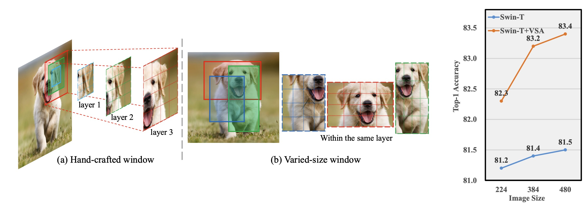
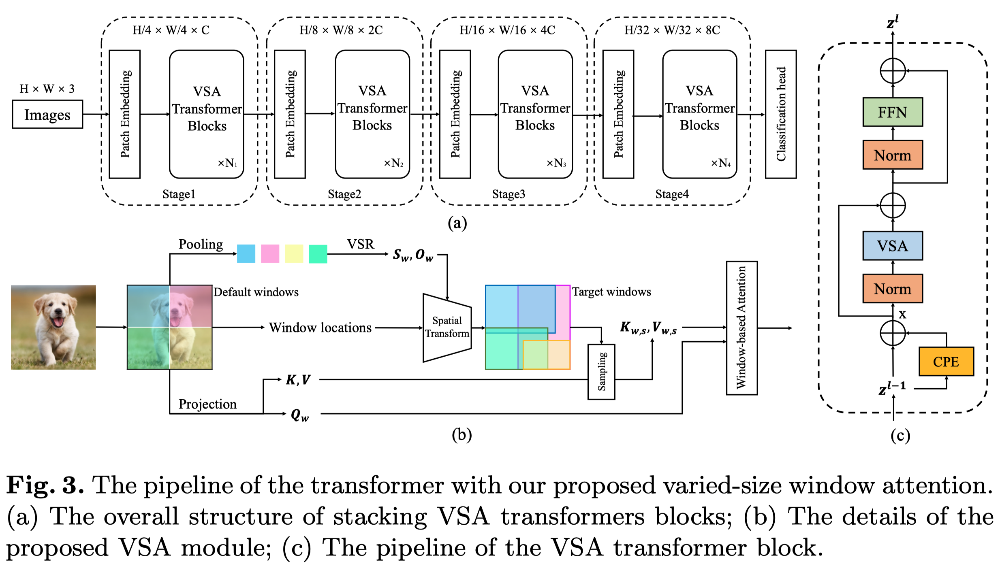

<h1 align="left">[ECCV 2020] VSA: Learning Varied-Size Window Attention in
Vision Transformers<a href="https://arxiv.org/abs/2204.08446">.svg" ></a></h1> 

<p align="center">
  <a href="#Updates">Updates</a> |
  <a href="#introduction">Introduction</a> |
  <a href="#statement">Statement</a> |
</p>

## Current applications

> **Classification**: Please see <a href="https://github.com/ViTAE-Transformer/ViTAE-VSA/tree/main/Image-Classification">ViTAE-VSA for Image Classification</a> for usage detail;

> **Object Detection**: Please see <a href="https://github.com/ViTAE-Transformer/ViTAE-VSA/tree/main/Object-Detection">ViTAE-VSA for Object Detection</a> for usage detail;

> **Semantic Segmentation**: Will be released in next few days;

## Other ViTAE applications

> **ViTAE & ViTAEv2**: Please see <a href="https://github.com/ViTAE-Transformer/ViTAE-Transformer">ViTAE-Transformer for Image Classification, Object Detection, and Sementic Segmentation</a>;

> **Matting**: Please see <a href="https://github.com/ViTAE-Transformer/ViTAE-Transformer-Matting">ViTAE-Transformer for matting</a>;

> **Remote Sensing**: Please see <a href="https://github.com/ViTAE-Transformer/ViTAE-Transformer-Remote-Sensing">ViTAE-Transformer for Remote Sensing</a>;


## Updates

***19/09/2022***
- The code and training logs for ViTAE-VSA have been released! The semantic segmentation and Swin+VSA will be relased in next few days.

***09/07/2022***
- The paper is accepted by ECCV'22!

***19/04/2022***
- The paper is post on arxiv! The code will be made public available once cleaned up.

## Introduction

<p align="left">This repository contains the code, models, test results for the paper <a href="https://arxiv.org/pdf/2204.08446.pdf">VSA: Learning Varied-Size Window Attention in
Vision Transformers</a>. We design a novel varied-size window attention module which learns adaptive window configurations from data. By adopting VSA in each head independently, the model can capture long-range dependencies and rich context information from diverse windows. VSA can replace the window attention in SOTA methods and faciliate the learning on various vision tasks including classification, detection and segmentation.

<figure>

<figcaption align = "center"><b>Fig.1 - The comparison of the current design (hand-crafted windows) and VSA.</b></figcaption>
</figure>

<figure>

<figcaption align = "center"><b>Fig.2 - The architecture of VSA .</b></figcaption>
</figure>

## Usage
> If you are interested in using the VSA attention only, please consider this [file](Image-Classification/vitaev2_vsa/vsa.py) in classification or the [VSAWindowAttention Class](Object-Detection/mmdet/models/backbones/vitaev2_vsa_modules/window.py) in object detection applications.

## Classification Results
> ViTAEv2* denotes the version using window attention for all stages, which have much less memory requirements anc computations.

### Main Results on ImageNet-1K with pretrained models
| name | resolution | acc@1 | acc@5 | acc@RealTop-1 | Pretrained |
| :---: | :---: | :---: | :---: | :---: | :---: |
| Swin-T | 224x224 | 81.2 | \ | \ | \ |
| Swin-T+VSA | 224x224 | 82.24 | 95.8 | \ | Coming Soon |
| ViTAEv2*-S | 224x224 | 82.2 | 96.1 | 87.5 | \ |
| ViTAEv2-S | 224x224 | 82.6 | 96.2 | 87.6 | [weights]()&[logs](Image-Classification/vitaev2/output/ViTAEv2_S.txt) |
| ViTAEv2*-S+VSA | 224x224 | 82.7 | 96.3 | 87.7 | [weights]()&[logs](Image-Classification/vitaev2_vsa/output/ViTAEv2-S+VSA.txt) |
| Swin-S | 224x224 | 83.0 | \ | \ | \ |
| Swin-S+VSA | 224x224 | 83.6 | 96.6 | \ | Coming Soon |
| ViTAEv2*-48M+VSA | 224x224 | 83.9 | 96.6 | \ | [weights]()&[logs](Image-Classification/vitaev2_vsa/output/ViTAEv2-48M+VSA.txt) |

### Models with ImageNet-22K pretraining
| name | resolution | acc@1 | acc@5 | acc@RealTop-1 | Pretrained |
| :---: | :---: | :---: | :---: | :---: | :---: |
| ViTAEv2*-48M+VSA | 224x224 | 84.9 | 97.4 | \ | Coming Soon |
| ViTAEv2*-B+VSA | 224x224 | 86.2 | 97.9 | 90.0 | Coming Soon |

## Object Detection Results
> ViTAEv2* denotes the version using window attention for all stages, which have much less memory requirements anc computations.
### Mask R-CNN

| Backbone | Pretrain | Lr Schd | box mAP | mask mAP | #params | config | log | model |
| :---: | :---: | :---: | :---: | :---: | :---: | :---: | :---: |:---: |
| ViTAEv2*-S | ImageNet-1K | 1x | 43.5 | 39.4 | 37M | \ | \ | \ |
| ViTAEv2-S | ImageNet-1K | 1x | 46.3 | 41.8 | 37M | [config](Object-Detection/configs/vitaev2/mask_rcnn_vitaev2_s_mstrain_480-800_adamw_1x_coco.py) | [github](https://github.com/ViTAE-Transformer/ViTAE-Transformer/blob/main/Object-Detection/log/mask_rcnn_vitaev2_s-480-800_adamw_1x_coco.out) | Coming Soon |
| ViTAEv2*-S+VSA | ImageNet-1K | 1x | 45.9 | 41.4 | 37M | [config](Object-Detection/configs/vitaev2_vsa/mask_rcnn_vitaev2_vsa_s_mstrain_480-800_adamw_1x_coco.py) | [github](Object-Detection/log/mask_rcnn_vitaev2_vsa_s_mstrain_480-800_adamw_1x_coco.log) | coming soon |
| ViTAEv2*-S | ImageNet-1K | 3x | 44.7 | 40.0 | 39M | \ | \ | \ |
| ViTAEv2-S | ImageNet-1K | 3x | 47.8 | 42.6 | 37M | [config](Object-Detection/configs/vitaev2/mask_rcnn_vitaev2_s_mstrain_480-800_adamw_3x_coco.py) | [github](https://github.com/ViTAE-Transformer/ViTAE-Transformer/blob/main/Object-Detection/log/mask_rcnn_vitaev2_s-480-800_adamw_3x_coco.out) | Coming Soon |
| ViTAEv2*-S+VSA  | ImageNet-1K | 3x | 48.1 | 42.9 | 39M | [config](Object-Detection/configs/vitaev2/mask_rcnn_vitaev2_s_mstrain_480-800_adamw_3x_coco.py) | [github](Object-Detection/log/mask_rcnn_vitaev2_vsa_s_mstrain_480-800_adamw_3x_coco.log) | Coming Soon |
| ViTAEv2*-48M+VSA | ImageNet-1K | 3x | 49.9 | 44.2 | 69M | [config](Object-Detection/configs/vitaev2_vsa/mask_rcnn_vitaev2_vsa_48M_mstrain_480-800_adamw_3x_coco.py) | [github](Object-Detection/log/mask_rcnn_vitaev2_48M_mstrain_480-800_adamw_3x_coco.log) | Coming Soon |

### Cascade Mask R-CNN

| Backbone | Pretrain | Lr Schd | box mAP | mask mAP | #params | config | log | model |
| :---: | :---: | :---: | :---: | :---: | :---: | :---: | :---: |:---: |
| ViTAEv2*-S | ImageNet-1K | 1x | 47.3 | 40.6 | 77M | \ | \ | \ |
| ViTAEv2-S | ImageNet-1K | 1x | 50.6 | 43.6 | 75M | [config](Object-Detection/configs/vitaev2/cascade_mask_rcnn_vitaev2_s_mstrain_480-800_giou_4conv1f_adamw_1x_coco.py) | [github](https://github.com/ViTAE-Transformer/ViTAE-Transformer/blob/main/Object-Detection/log/cascade_mask_rcnn_vitaev2_s_mstrain_480-800_giou_4conv1f_adamw_1x_coco.out) | Coming Soon |
| ViTAEv2*-S+VSA | ImageNet-1K | 1x | 49.8 | 43.0 | 77M | [config](Object-Detection/configs/vitaev2_vsa/cascade_mask_rcnn_vitaev2_vsa_s_mstrain_480-800_giou_4conv1f_adamw_1x_coco.py) | [github](Object-Detection/log/cascade_mask_rcnn_vitaev2_vsa_s_mstrain_480-800_giou_4conv1f_adamw_1x_coco.log) | Coming Soon |
| ViTAEv2*-S | ImageNet-1K | 3x | 48.0 | 41.3 | 77M | \ | \ | \ |
| ViTAEv2-S | ImageNet-1K | 3x | 51.4 | 44.5 | 75M | [config](Object-Detection/configs/vitaev2/cascade_mask_rcnn_vitaev2_s_mstrain_480-800_giou_4conv1f_adamw_3x_coco.py) | [github](https://github.com/ViTAE-Transformer/ViTAE-Transformer/blob/main/Object-Detection/log/cascade_mask_rcnn_vitaev2_s_mstrain_480-800_giou_4conv1f_adamw_3x_coco.out) | Coming Soon |
| ViTAEv2*-S+VSA | ImageNet-1K | 3x | 51.9 | 44.8 | 77M | [config](Object-Detection/configs/vitaev2_vsa/cascade_mask_rcnn_vitaev2_vsa_s_mstrain_480-800_giou_4conv1f_adamw_3x_coco.py) | [github](Object-Detection/log/cascade_mask_rcnn_vitaev2_vsa_s_mstrain_480-800_giou_4conv1f_adamw_3x_coco.log) | Coming Soon |
| ViTAEv2*-48M+VSA | ImageNet-1k | 3x | 52.9 | 45.6 | 108M | [config](Object-Detection/configs/vitaev2_vsa/cascade_mask_rcnn_vitaev2_vsa_48M_mstrain_480-800_giou_4conv1f_adamw_3x_coco.py) | [github](Object-Detection/log/cascade_mask_rcnn_vitaev2_vsa_48M_mstrain_480-800_giou_4conv1f_adamw_3x_coco.log) | coming soon |

<!-- | Swin-T | ImageNet-1K | 3x | 50.2 | 43.5 | 86M | [config](configs/swin/cascade_mask_rcnn_swin_tiny_patch4_window7_mstrain_480-800_giou_4conv1f_adamw_3x_coco.py) | [github](https://github.com/SwinTransformer/storage/releases/download/v1.0.3/moby_cascade_mask_rcnn_swin_tiny_patch4_window7_3x.log.json)/[baidu](https://pan.baidu.com/s/1zEFXHYjEiXUCWF1U7HR5Zg) | [github](https://github.com/SwinTransformer/storage/releases/download/v1.0.3/moby_cascade_mask_rcnn_swin_tiny_patch4_window7_3x.pth)/[baidu](https://pan.baidu.com/s/1FMmW0GOpT4MKsKUrkJRgeg) | -->
## Semantic Segmentation Results for Cityscapes
ViTAEv2* denotes the version using window attention for all stages.
### UperNet
> 512x1024 resolution for training and testing

| Backbone | Pretrain | Lr Schd | mIoU | mIoU* | #params | config | log | model |
| :---: | :---: | :---: | :---: | :---: | :---: | :---: | :---: |:---: |
| Swin-T | ImageNet-1k | 40k | 78.9 | 79.9 | \ | \ | \ | \ |
| Swin-T+VSA | ImageNet-1k | 40k | 80.8 | 81.7 | \ | \ | \ | \ |
| ViTAEv2*-S | ImageNet-1k | 40k | 80.1 | 80.9 | \ | \ | \ | \ |
| ViTAEv2*-S+VSA | ImageNet-1k | 40k | 81.4 | 82.3 | \ | \ | \ | \ |
| Swin-T | ImageNet-1k | 80k | 79.3 | 80.2 | \ | \ | \ | \ |
| Swin-T+VSA | ImageNet-1k | 80k | 81.6 | 82.4 | \ | \ | \ | \ |
| ViTAEv2*-S | ImageNet-1k | 80k | 80.8 | 81.0 | \ | \ | \ | \ |
| ViTAEv2*-S+VSA | ImageNet-1k | 80k | 82.2 | 83.0 | \ | \ | \ | \ |


> 769x769 resolution for training and testing

| Backbone | Pretrain | Lr Schd | mIoU | ms mIoU | #params | config | log | model |
| :---: | :---: | :---: | :---: | :---: | :---: | :---: | :---: |:---: |
| Swin-T | ImageNet-1k | 40k | 79.3 | 80.1 | \ | \ | \ | \ |
| Swin-T+VSA | ImageNet-1k | 40k | 81.0 | 81.9 | \ | \ | \ | \ |
| ViTAEv2*-S | ImageNet-1k | 40k | 79.6 | 80.6 | \ | \ | \ | \ |
| ViTAEv2*-S+VSA | ImageNet-1k | 40k | 81.7 | 82.5 | \ | \ | \ | \ |
| Swin-T | ImageNet-1k | 80k | 79.6 | 80.1 | \ | \ | \ | \ |
| Swin-T+VSA | ImageNet-1k | 80k | 81.6 | 82.5 | \ | \ | \ | \ |

Please refer to our paper for more experimental results.
## Statement
This project is for research purpose only. For any other questions please contact [qmzhangzz at hotmail.com](mailto:qmzhangzz@hotmail.com) [yufei.xu at outlook.com](mailto:yufei.xu@outlook.com).

## Citing VSA and ViTAE
```
@article{zhang2022vsa,
  title={VSA: Learning Varied-Size Window Attention in Vision Transformers},
  author={Zhang, Qiming and Xu, Yufei and Zhang, Jing and Tao, Dacheng},
  journal={arXiv preprint arXiv:2204.08446},
  year={2022}
}
@article{zhang2022vitaev2,
  title={ViTAEv2: Vision Transformer Advanced by Exploring Inductive Bias for Image Recognition and Beyond},
  author={Zhang, Qiming and Xu, Yufei and Zhang, Jing and Tao, Dacheng},
  journal={arXiv preprint arXiv:2202.10108},
  year={2022}
}
@article{xu2021vitae,
  title={Vitae: Vision transformer advanced by exploring intrinsic inductive bias},
  author={Xu, Yufei and Zhang, Qiming and Zhang, Jing and Tao, Dacheng},
  journal={Advances in Neural Information Processing Systems},
  volume={34},
  year={2021}
}
```