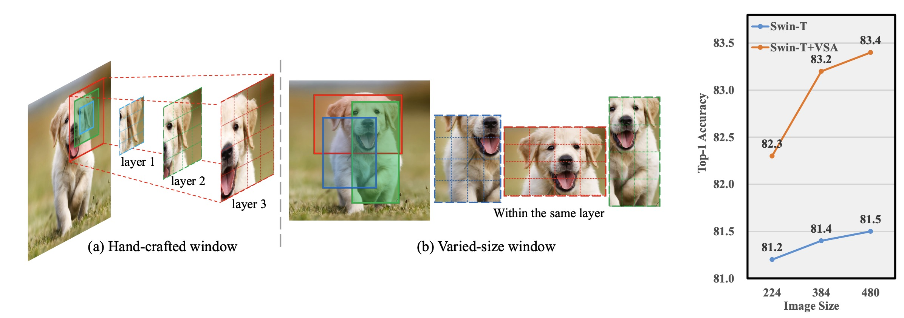
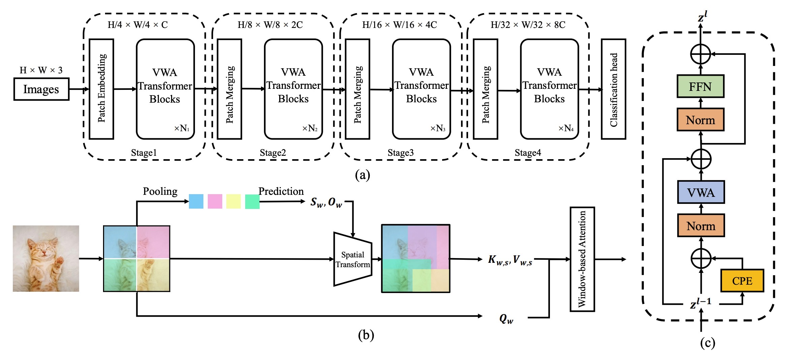

<h1 align="left">VSA: Learning Varied-Size Window Attention in
Vision Transformers<a href="https://arxiv.org/abs/2204.08446">.svg" ></a></h1> 

<p align="center">
  <a href="#Updates">Updates</a> |
  <a href="#introduction">Introduction</a> |
  <a href="#statement">Statement</a> |
</p>

## Current applications

> **Image Classification, Object Detection, and Sementic Segmentation**: Please see <a href="https://github.com/ViTAE-Transformer/ViTAE-Transformer">ViTAE-Transformer for image classification</a>;

> **Matting**: Please see <a href="https://github.com/ViTAE-Transformer/ViTAE-Transformer-Matting">ViTAE-Transformer for matting</a>;

> **Remote Sensing**: Please see <a href="https://github.com/ViTAE-Transformer/ViTAE-Transformer-Remote-Sensing">ViTAE-Transformer for Remote Sensing</a>;


## Updates

***19/04/2021***
- The paper is post on arxiv! The code will be made public available once cleaned up.

## Introduction

<p align="left">This repository contains the code, models, test results for the paper <a href="https://arxiv.org/pdf/2204.08446.pdf">VSA: Learning Varied-Size Window Attention in
Vision Transformers</a>. We design a novel varied-size window attention module which learns adaptive window configurations from data. By adopting VSA in each head independently, the model can capture long-range dependencies and rich context information from diverse windows. VSA can replace the window attention in SOTA methods and faciliate the learning on various vision tasks including classification, detection and segmentation.

<figure>

<figcaption align = "center"><b>Fig.1 - The comparison of the current design (hand-crafted windows) and VSA.</b></figcaption>
</figure>

<!-- <figure>

<figcaption align = "center"><b>Fig.2 - The architecture of VSA .</b></figcaption>
</figure> -->
## Code and Usage
The code will be released soon.

## Classification Results

### Main Results on ImageNet-1K with pretrained models
| name | resolution | acc@1 | acc@5 | acc@RealTop-1 | Pretrained |
| :---: | :---: | :---: | :---: | :---: | :---: |
| Swin-T | 224x224 | 81.2 | \ | \ | \ |
| Swin-T+VSA | 224x224 | 82.3 | 96.1 | 87.5 | Coming Soon |
| ViTAEv2-S | 224x224 | 82.2 | 96.1 | 87.5 | \ |
| ViTAEv2-S+VSA | 224x224 | 82.7 | 96.3 | 87.7 | Coming Soon |
| Swin-S | 224x224 | 83.0 | \ | \ | \ |
| Swin-S+VSA | 224x224 | 83.8 | 96.8 | 88.5 | Comming Soon |
| ViTAEv2-48M+VSA | 224x224 | 83.9 | \ | \ | Coming Soon |

### Models with ImageNet-22K pretraining
| name | resolution | acc@1 | acc@5 | acc@RealTop-1 | Pretrained |
| :---: | :---: | :---: | :---: | :---: | :---: |
| ViTAEv2-48M+VSA | 224x224 | 84.9 | \ | \ | Coming Soon |
| ViTAEv2-B+VSA | 224x224 | 86.2 | 97.9 | 90.0 | Coming Soon |

ViTAEv2 denotes the version using window attention for all stages.
## Object Detection Results
ViTAEv2 denotes the version using window attention for all stages.
### Mask R-CNN

| Backbone | Pretrain | Lr Schd | box mAP | mask mAP | #params | config | log | model |
| :---: | :---: | :---: | :---: | :---: | :---: | :---: | :---: |:---: |
| ViTAEv2-S | ImageNet-1K | 1x | 43.5 | 39.4 | 39M | \ | \ | \ |
| ViTAEv2-S+VSA | ImageNet-1K | 1x | 45.9 | 41.4 | 39M | \ | Comming Soon | Coming Soon |
| ViTAEv2-S | ImageNet-1K | 3x | 44.7 | 40.0 | 39M | \ | Comming Soon | Coming Soon |
| ViTAEv2-S+VSA | ImageNet-1K | 3x | 48.1 | 42.9 | 39M | \ | Comming Soon | Coming Soon |
| ViTAEv2-48M+VSA | ImageNet-1K | 3x | 49.9 | 44.2 | 69M | \ |Comming Soon | Coming Soon |

### Cascade Mask R-CNN

| Backbone | Pretrain | Lr Schd | box mAP | mask mAP | #params | config | log | model |
| :---: | :---: | :---: | :---: | :---: | :---: | :---: | :---: |:---: |
| ViTAEv2-S | ImageNet-1K | 1x | 47.3 | 40.6 | 77M | \ | \ | \ |
| ViTAEv2-S+VSA | ImageNet-1K | 1x | 49.8 | 43.0 | 77M | \ | Comming Soon | Coming Soon |
| ViTAEv2-S | ImageNet-1K | 3x | 48.0 | 41.3 | 77M | \ | \ | \ |
| ViTAEv2-S+VSA | ImageNet-1K | 3x | 51.9 | 44.8 | 77M | \ | Comming Soon | Coming Soon |

<!-- | Swin-T | ImageNet-1K | 3x | 50.2 | 43.5 | 86M | [config](configs/swin/cascade_mask_rcnn_swin_tiny_patch4_window7_mstrain_480-800_giou_4conv1f_adamw_3x_coco.py) | [github](https://github.com/SwinTransformer/storage/releases/download/v1.0.3/moby_cascade_mask_rcnn_swin_tiny_patch4_window7_3x.log.json)/[baidu](https://pan.baidu.com/s/1zEFXHYjEiXUCWF1U7HR5Zg) | [github](https://github.com/SwinTransformer/storage/releases/download/v1.0.3/moby_cascade_mask_rcnn_swin_tiny_patch4_window7_3x.pth)/[baidu](https://pan.baidu.com/s/1FMmW0GOpT4MKsKUrkJRgeg) | -->
## Semantic Segmentation Results
ViTAEv2 denotes the version using window attention for all stages.
### UperNet
> 512x1024 resolution for training and testing

| Backbone | Pretrain | Lr Schd | mIoU | mIoU* | #params | config | log | model |
| :---: | :---: | :---: | :---: | :---: | :---: | :---: | :---: |:---: |
| Swin-T | ImageNet-1k | 40k | 78.9 | 79.9 | \ | \ | \ | \ |
| Swin-T+VSA | ImageNet-1k | 40k | 80.8 | 81.7 | \ | \ | \ | \ |
| ViTAEv2-S | ImageNet-1k | 40k | 80.1 | 80.9 | \ | \ | \ | \ |
| ViTAEv2-S+VSA | ImageNet-1k | 40k | 81.4 | 82.3 | \ | \ | \ | \ |
| Swin-T | ImageNet-1k | 80k | 79.3 | 80.2 | \ | \ | \ | \ |
| Swin-T+VSA | ImageNet-1k | 80k | 81.6 | 82.4 | \ | \ | \ | \ |
| ViTAEv2-S | ImageNet-1k | 80k | 80.8 | 81.0 | \ | \ | \ | \ |
| ViTAEv2-S+VSA | ImageNet-1k | 80k | 82.2 | 83.0 | \ | \ | \ | \ |


> 769x769 resolution for training and testing

| Backbone | Pretrain | Lr Schd | mIoU | ms mIoU | #params | config | log | model |
| :---: | :---: | :---: | :---: | :---: | :---: | :---: | :---: |:---: |
| Swin-T | ImageNet-1k | 40k | 79.3 | 80.1 | \ | \ | \ | \ |
| Swin-T+VSA | ImageNet-1k | 40k | 81.0 | 81.9 | \ | \ | \ | \ |
| ViTAEv2-S | ImageNet-1k | 40k | 79.6 | 80.6 | \ | \ | \ | \ |
| ViTAEv2-S+VSA | ImageNet-1k | 40k | 81.7 | 82.5 | \ | \ | \ | \ |
| Swin-T | ImageNet-1k | 80k | 79.6 | 80.1 | \ | \ | \ | \ |
| Swin-T+VSA | ImageNet-1k | 80k | 81.6 | 82.5 | \ | \ | \ | \ |

Please refer to our paper for more experimental results.
## Statement
This project is for research purpose only. For any other questions please contact [qmzhangzz at hotmail.com](mailto:qmzhangzz@hotmail.com) [yufei.xu at outlook.com](mailto:yufei.xu@outlook.com).

## Citing VSA
```
@article{zhang2022vsa,
  title={VSA: Learning Varied-Size Window Attention in Vision Transformers},
  author={Zhang, Qiming and Xu, Yufei and Zhang, Jing and Tao, Dacheng},
  journal={arXiv preprint arXiv:2204.08446},
  year={2022}
}
```